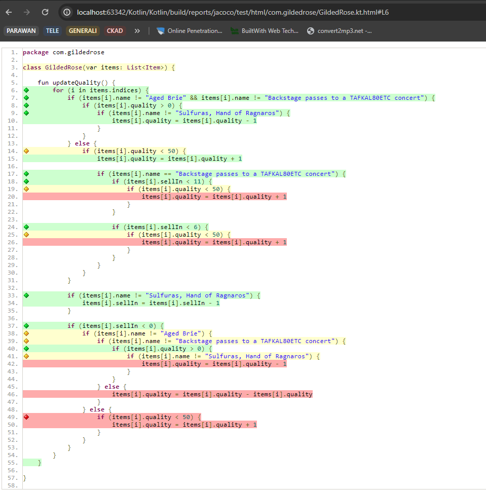
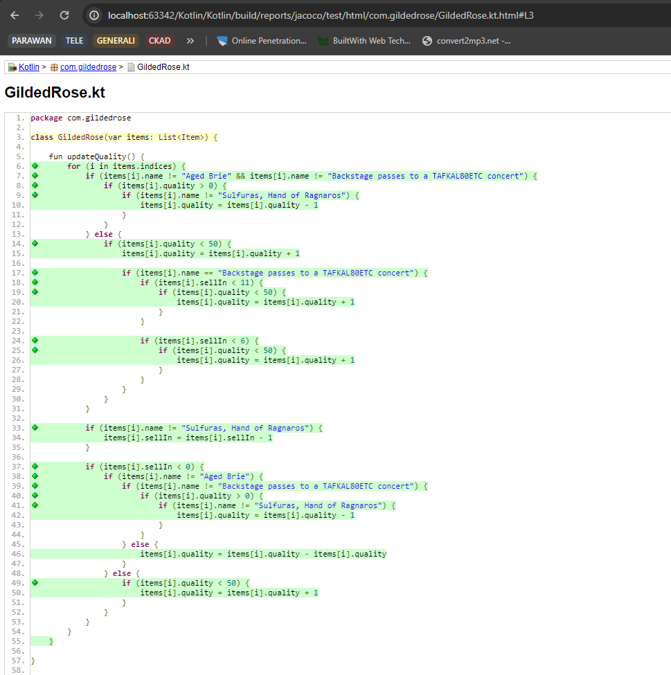

# Gilded Rose starting position in Kotlin

## Run the Text Fixture from Command-Line

```
./gradlew -q text
```

### Specify Number of Days

For e.g. 10 days:

```
./gradlew run --args 10
```

You should make sure the gradle commands shown above work when you execute them in a terminal before trying to use TextTest (see below).


## Run the TextTest approval test that comes with this project

There are instructions in the [TextTest Readme](../texttests/README.md) for setting up TextTest. What's unusual for the Java version is there are two executables listed in [config.gr](../texttests/config.gr) for Java. One uses Gradle wrapped in a python script, the other relies on your CLASSPATH being set correctly in [environment.gr](../texttests/environment.gr).


## Starting Point 

### Project info
1. Code is highly unreadable and impossible to extend
2. Algorithm and test cases are unknown, I do not trust that `TexttestFixtures` covers all paths so I want to validate it with jacoco
3. Codebase is just 60 LOC and edge-values seems to be small values 

### Plan of action
1. Generate all test cases / convert `TexttestFixtures` to tests
2. Break complex statements, make code longer and simpler
3. understand algorithm and propose better solution


## Execution
### Testing TexttestFixtures
TexttestFixtures indeed do not cover all paths, based on jacoco coverage: 
 

There are two ways to advance:
1. manually craft extra test cases
2. auto generate a bunch of test cases
 
I prefer to go with (2) because it seems to me to be more resilient way. I need to check if execution 
time is not bloated. Also minimize number of test cases.

### Test cases generation
I copied GildedRose class to PlatinumRose and implemented a test which executes both app 
and then compare results. Time of execution is under 500ms which is great. Also all paths are covered:



One noticeable fact i that items are declared as `var` which makes it possible to update during/after execution.
In my opinion this is a design issue, code-smell and I'm going to change it to `val`.
So far I only changed Item to data class so that object comparison is easier, also it seems to be DTO/record so it suppose to be a data class
