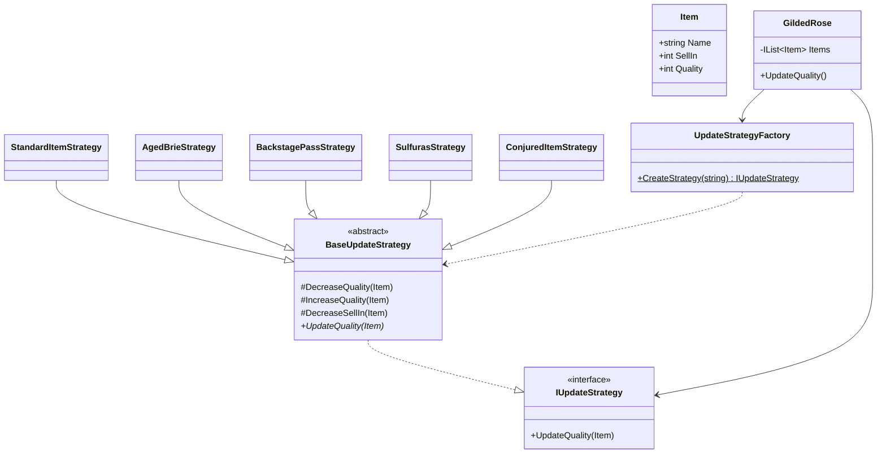

# GildedRose Refactoring Kata - C# Solution

This solution demonstrates a refactoring of the GildedRose kata using clean code principles and design patterns.

## Design Patterns Used

### Class Diagram


### 1. Strategy Pattern
The main design pattern used in this refactoring is the Strategy Pattern, which enables:
- Encapsulation of different item update algorithms
- Easy addition of new item types
- Elimination of complex conditional logic

The pattern is implemented through:
- `IUpdateStrategy`: Interface defining the contract for all strategies
- `BaseUpdateStrategy`: Abstract base class with common functionality
- Concrete strategies for each item type:
  - `StandardItemStrategy`
  - `AgedBrieStrategy`
  - `BackstagePassStrategy`
  - `SulfurasStrategy`
  - `ConjuredItemStrategy`

### 2. Factory Pattern
The Factory Pattern is used to create appropriate strategies:
- `UpdateStrategyFactory`: Creates the correct strategy based on item name
- Centralizes strategy instantiation
- Makes it easy to add new item types

## Code Structure

```
GildedRose/
├── ItemCategory.cs           # Constants and configuration
├── IUpdateStrategy.cs        # Strategy interface
├── BaseUpdateStrategy.cs     # Common strategy functionality
├── Strategies/              
│   ├── StandardItemStrategy.cs
│   ├── AgedBrieStrategy.cs
│   ├── BackstagePassStrategy.cs
│   ├── SulfurasStrategy.cs
│   └── ConjuredItemStrategy.cs
└── UpdateStrategyFactory.cs  # Factory for creating strategies
```

## Key Improvements

1. **Separation of Concerns**
   - Each item type has its own strategy class
   - Common functionality extracted to base class
   - Clear responsibility boundaries

2. **Maintainability**
   - Eliminated nested if statements
   - Removed code duplication
   - Centralized constants
   - Easy to modify individual item behaviors

3. **Extensibility**
   - Adding new item types only requires:
     1. Creating a new strategy class
     2. Adding item name to ItemCategory
     3. Adding strategy to factory
   - No modification of existing code needed (Open/Closed Principle)

4. **Testability**
   - Each strategy can be tested independently
   - Clear test cases for each item type
   - Easy to add tests for new items

## How to Use

1. **Adding a New Item Type**
   ```csharp
   // 1. Add item name to ItemCategory
   public static class ItemCategory
   {
       public const string NewItem = "New Item Name";
   }

   // 2. Create new strategy
   public class NewItemStrategy : BaseUpdateStrategy
   {
       public override void UpdateQuality(Item item)
       {
           // Implement update logic
       }
   }

   // 3. Add to factory
   public static class UpdateStrategyFactory
   {
       public static IUpdateStrategy CreateStrategy(string itemName)
       {
           return itemName switch
           {
               ItemCategory.NewItem => new NewItemStrategy(),
               // ... existing cases
           };
       }
   }
   ```

2. **Modifying Item Behavior**
   - Locate the appropriate strategy class
   - Modify the UpdateQuality method
   - Add/update tests as needed

## Testing

The solution includes comprehensive tests:
- Unit tests for each item type
- Edge case testing
- Approval tests for system behavior
- Quality boundary tests
- SellIn date tests

## Future Enhancements

The code is structured to easily accommodate future changes:
- Double degradation for Conjured items
- New item types
- Modified quality rules
- Additional item properties

## Design Principles Applied

- **Single Responsibility Principle**: Each class has one reason to change
- **Open/Closed Principle**: Open for extension, closed for modification
- **Dependency Inversion**: High-level modules depend on abstractions
- **DRY (Don't Repeat Yourself)**: Common logic in base class
- **KISS (Keep It Simple, Stupid)**: Clear, straightforward implementations
