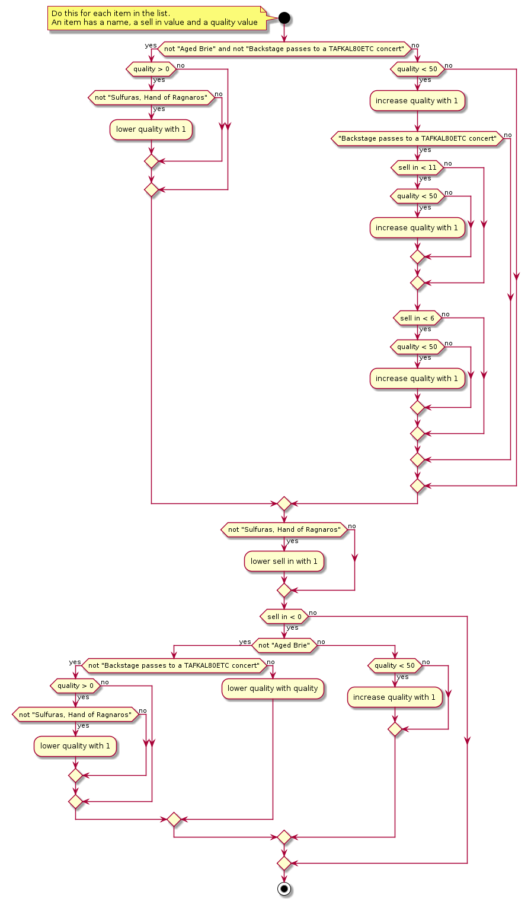

# PlantUML
This UML refactoring exercise is aimed at less technical people like analysts, testers and other non-programmers. The key takeaway message is clarifying the need for continuous refactoring to people who do not code on a daily basis.

## Running and rendering
If you want to get started quickly, just copy the contents of `plantuml/gilded-rose.puml`, and paste it in https://www.planttext.com/

Several alternatives are available to render PlantUML, see https://plantuml.com/running.

## Syntax
For the syntax of activity diagrams in PlantUML, please refer to https://plantuml.com/activity-diagram-beta

## Workshop
You can run this exercise as a workshop.

During this workshop, you start off with a presentation explaining the domain, while filling out the testcases found under `plantuml/workshop`. After that, participants are invited to refactor the UML Activity Diagram, using the examples that were discovered during the presentation. 
[The google slides can be found here](https://docs.google.com/presentation/d/1kkRnVQjZELcfuGoFXaiSY_HxbO4lPQnSgHRGQZIH2nU/edit?usp=sharing). 

## History
If you want to illustrate how this activity diagram got to this state, you can show the requirements and the files under the /history directory. These individual files show the evolution of the activity diagram.

## Original state

