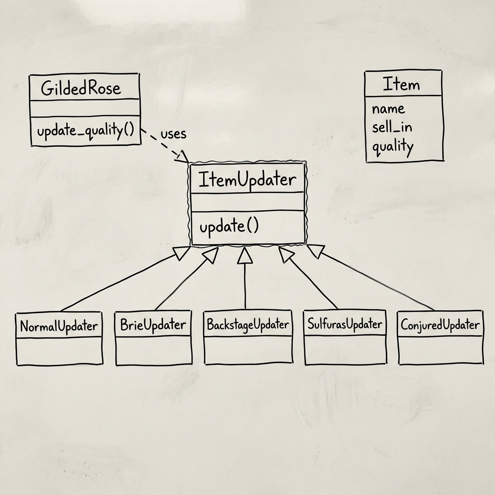

# Gilded Rose Design

**Pattern Used:** Strategy Pattern

---

## The Problem

The original code is a mess of nested if-statements. Hard to read, hard to change.

## The Solution

Give each item type its own class to handle updates:

- **NormalUpdater** - normal items degrade
- **BrieUpdater** - gets better with age
- **BackstageUpdater** - special concert rules
- **SulfurasUpdater** - never changes
- **ConjuredUpdater** - degrades 2x faster

## Why This Works

1. **Easy to add new items** - just make a new updater class
2. **Easy to read** - each class does one thing
3. **Easy to test** - test each updater separately

## Drawbacks

- More files to manage
- Factory needs updating for new items

---

